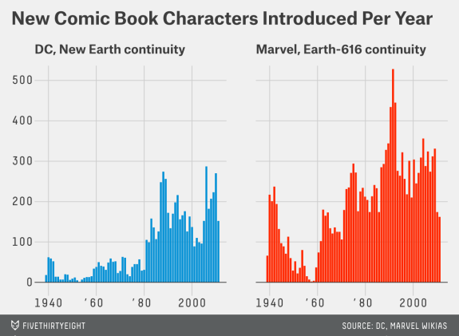

## The original plots and article
The graph was first created for the FiveThirtyEight article ["Comic Books Are Still Made By Men, For Men And About Men"](https://fivethirtyeight.com/features/women-in-comic-books/) by Walt Hickey in October of 2014

### Plot photo
This is the plot I will be reproducing:  


## Code to reproduce
Read in data set
```{r}
dcdata <- read.csv("./data/dc-wikia-data.csv")
marveldata <- read.csv("./data/marvel-wikia-data.csv")
```

Load libraries needed
```{r}
library(ggplot2)
library(dplyr)
library(RColorBrewer)
```

### Recreating "New Comic Book Characters introduced Per Year"
```{r}
#combine data into a single data set 
dcdata$type <- "DC"
marveldata$type <- "Marvel"
colnames(marveldata)[colnames(marveldata)=="Year"] <- "YEAR"
comicdata<-rbind(marveldata, dcdata)

#Want a total number of characters introduced each year for marvel and dc separately
labels <- c(DC="DC, New Earth continuity", Marvel="Marvel, Earth-616 continuity") 
ggplot(comicdata) + 
  geom_bar(aes(x=YEAR, fill=type), width = 0.73) + scale_fill_manual(values=c("steelblue1", "orangered")) +
   facet_grid(.~type, labeller = labeller(type=labels)) +
    theme(strip.text.x = element_text(size=13, face="bold"),
          strip.text.y = element_text(size=13, face="bold"),
          strip.background = element_rect(fill = "grey93")) +
  ggtitle("New Comic Book Characters Introduced Per Year") +
    theme(plot.title = element_text(lineheight = .8, face="bold"),
          axis.title.x = element_blank(),
          axis.title.y = element_blank()) +
    theme(plot.background = element_rect(fill="grey93"),
          panel.grid.major = element_line(color="grey"),
          panel.grid.minor = element_line(color="grey"),
          legend.position = "none") +
    geom_hline(yintercept = 0, color = "black")+
  scale_y_continuous(breaks=seq(0,500,100)) +
  scale_x_continuous(breaks=c(1940,1960,1980,2000),
                   labels=c("1940","'60","'80","2000")) +
  theme(panel.grid.minor.y = element_blank(), panel.grid.minor.x = element_blank())

```

I learned after the fact that fivethrityeight has its own theme that I could have (should have) used instead of recreating the theme by hand, but here we are!